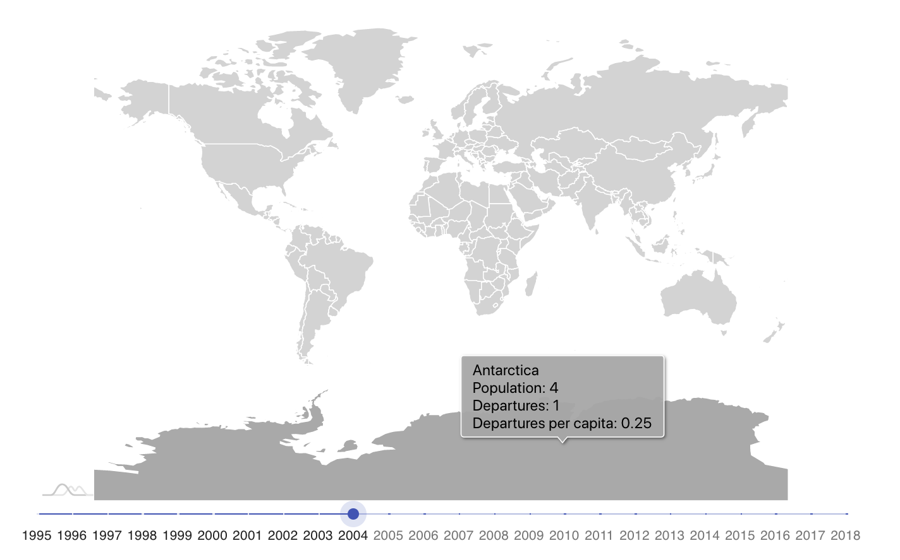
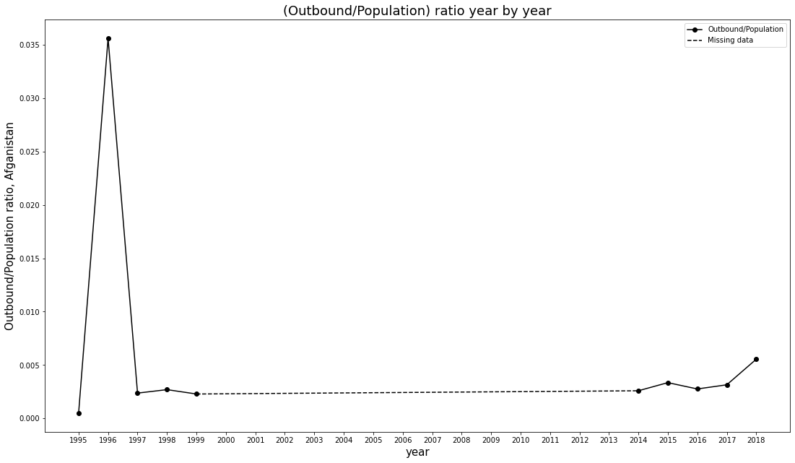
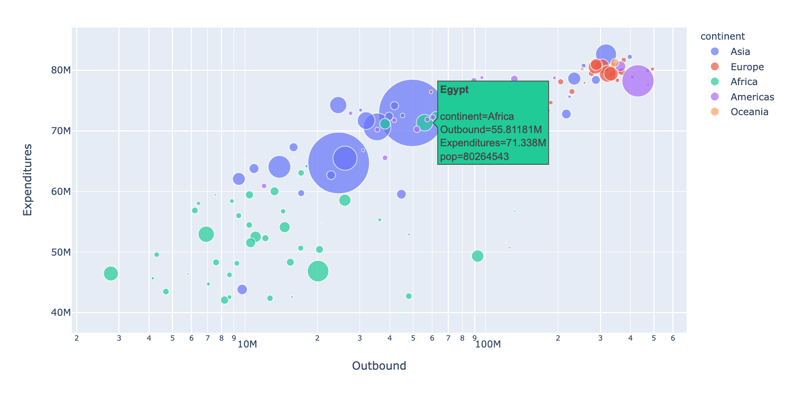

# Data Visualization Project
## Milestone 2

### Introduction  

During the COVID-19 pandemic, when the majority of people were staying in their home to prevent the spread of the disease and the aircraft were grounded, some of us were dreaming of traveling again. Interested in some economical and demographical aspects, we wished to provide some insight about international tourism and how much countries contributed to it. On an other point of view, an ecological one, it could also be used to determine how much inhabitants of a country contribute to fill the air with carbon emissions and where efforts should be done to reach the emission level that were fixed.

### Problematic  
We would like to study how popular and available tourism was and is in every country of the world. While the data along with nice visualisations of number of tourists departuring from every country [exists](https://data.worldbank.org/indicator/ST.INT.DPRT?type=points&year=1995) already, it does not display the actual popularity of traveling because it does not account for the population of the countries.  Moreover, we would like to estimate the expenses of tourists of each country. To perform the first task, the *(number of departures)/(country population)* ratio will be calculated for every country year by year (from 1995 to 2018). Similarly, for the second one, the ratio *(expenses)/(number of departures)* will be studied.  

### Visualizations  

#### Our website

Our website ([available here](https://com-480-data-visualization.github.io/data-visualization-project-2021-itv/)), is build with Preact, a lightweight version of React. It is currently structured on

We build our website automatically using Github Actions. For some unknown reason, the footer on the Github Pages hosted website is present twice on each page. Some link might not be working as well on the Github Pages website. It is not the case on our local build, we are investigating this issue. If we find so solution, we will probably host it elsewhere.

#### Home page  
The `Home` page of our website will display an interactive zoomable choropleth map of the world (see the sketch below). The data displayed will be either about outbound tourism ([definition](https://tourismteacher.com/outbound-tourism/)) divided by population of a given country or overall expenses for travel for each country divided by the number of departures (outbound). This theme will be selectable on the left corner (using a select field). The map will show countries with different colors depending on the value for the country for the selected theme. A slider at the bottom of the map will allow to select the year the user is interested in. When overing a country, a tooltip will display the country name as well as the real value used to define the color.

We would like to make the countries clickable so that when a user selects and clicks on a country, it is redirected to the bottom of the page where specific information about the country will be displayed. A year by year ratio *(number of departures)/(country population)* will be displayed for the selected country.  

Finally, it could be interesting to compare the countries we have data on with the expenses per number of out-going tourists (outbound). To visualise this relation, we have selected the bubble plot (see figure below), since this type of plot displays a big number of features (four). For instance, every bubble will correspond to a country, the size of the bubble will indicate the population of the country and the color of the bubble will correspond to the continent this country belongs to. It can provide insight about the level of wealth of the countries. We also expect some countries to form clusters. For example, european countries are expected to form a cluster in the up right corner of the plot, because these countries are relatively rich and europeans can easily travel within Europe. Bubble plot will be displayed once the year is selected by the user.  

#### About page

On the about page, we will describe the project, the context (Data Visualization class @ EPFL) as well as the dataset we used and its origin.

### Tools

* Javascript, HTML, CSS - basics
* __D3.js__ for interactions with DOM and visualizations
* [amCharts](https://www.amcharts.com/) for advanced maps
* __Preact__ for frontend

### Useful Lectures  
* Lecture 1.2 "*Basic Web Development*": basic knowledge about HTML, CSS and SVG  
* Lectures 2 and 3: "*Javascript 1 & 2*": basic knowledge about Javascript
* Lecture 4.2 "*Data Driven Documents*": selectors, data binding, reading data  
* Lecture 5.2 "*Interactive D3*": axes, events
* Lecture 6.1 "*Perception, Color*": choose the color palette for the plots  
* Lecture 7.2 "*Do's and Don'ts*": guidelines for the bar charts  

### Data  
The main dataset is `International Tourism Demographics` taken from [Kaggle](https://www.kaggle.com/ayushggarg/international-tourism-demographics) and provided by  the [World Bank](https://data.worldbank.org/) platform ([outbound](https://data.worldbank.org/indicator/ST.INT.DPRT), [expenditures](https://data.worldbank.org/indicator/ST.INT.XPND.CD)).  The complementary dataset, containing year by year country populations is also taken from the World Bank resource.    

__Missing data__  
* choropleth map: if the value for a country is unabailable, this country will be displayed in grey  
* line plot: the missing data will appear dashed  
* bubble chart: no bubble for a country if the data is missing  

### Possible enhancements

* It can be very interesting to add more information about the countries in the section dedicated to a specific country. Information such as demographics, culture, religion, money could be fetched (from WikiData for instance) and displayed.
* In the same vein as the previous point, for a given country, we could fetch information about the change in the political or religious regime or when wars took place in these country to explain the variations in the graphs.
