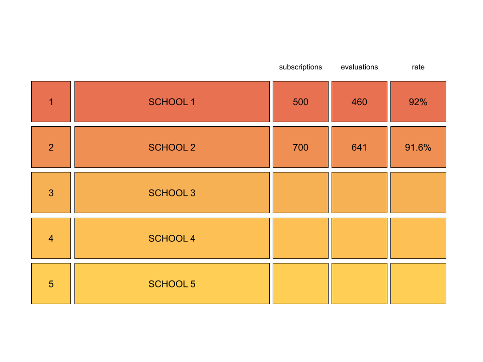
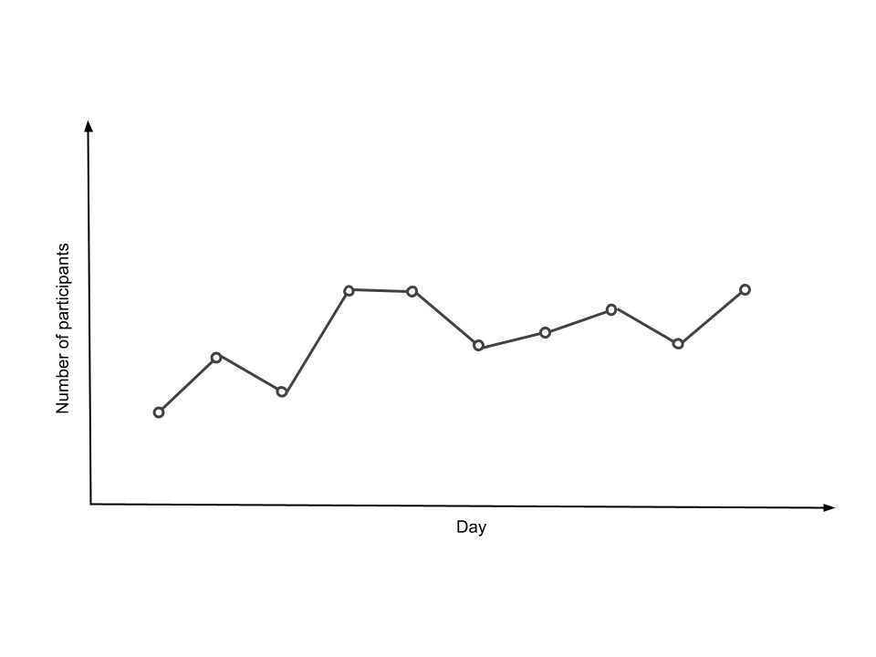
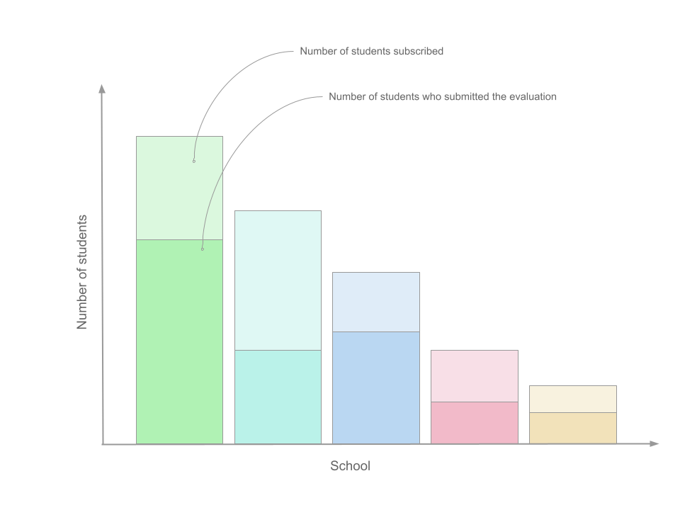
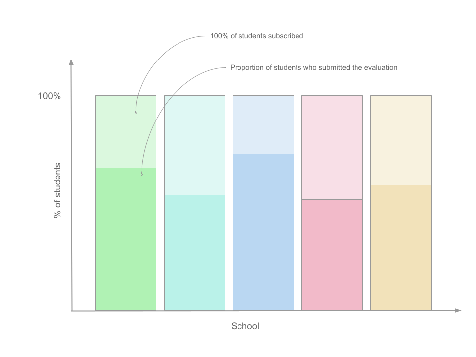

# Data Visualization Project
## Milestone 2

### Introduction  
Every semester EPFL students are invited to provide a feed-back on the courses they follow. The evaluation period lasts 10 days. Students can rate every course they are enrolled in and leave the comments with critics, compliments or improvements they would make to the course. 

### Problematic  
To extract valuable conclusions out of these feedbacks, it is important to have a participation rate above 60%. The goal of our project is to encourage students to take part in the course evaluations by gamifying the process and bringing some competition into it.  

### Visualizations  
#### Home page  
The `Home` page of our website will contain some general information about our project as well as the leaderboard (see figure below) displaying the schools with the highest participation rates.   

Below this global ranking, you will find a radial tree representing, from the center to the edge of the tree: the various schools, for each school their program and for each program the courses that are linked to them. We would like every element to be a link to a related page on the website displaying some analysis about the indicative feedbacks.

#### School page

On the School page, you will be able to select a school and for each school see the overall participation rate of the students enrolled in this section. It allows a quick comparison of the various programs motivation. Some other visual elements could be rendered such as:

* a ranking of the more evaluated courses
* a ranking of the ones with the highest number of student registered
* a ranking of the one with the higher rate of students outside the school offering the course (for instance: SV students for a ML course, in IC),…

#### Course page  

The `Course` page of our website will contain the results of the evaluations for a given course. The user will be able to research the course by it's ID.  

The figure below displays the number of students who have submitted their evaluations day by day for a given course.
  

The barplot below displays how many students are subscribed for a given course per school and how many of them have evaluated it.
  
For most part of the courses, the distribution of subscribed students of different schools is not even. In other words, 80% of students are very likely to come from the school which issued this course and the remaining 20% of students come from the different faculties (these numbers are arbitrary). In this case, the information about the minority schools will not be clearly visible in the above barplot. To fix this issue, the complementary barplot will be displayed (see figure below).  

Please have a look at our website since it better reflect the various vizualisations and how they will be displayed.

### Tools

* Javascript
* D3
* Preact

### Useful Lectures  

* Lecture 4 with D3
* Lecture 6 with perception color

### Possible Improvements  
* For the next evaluation period, collect the data on the fly, so that schools can have a "race"  (eventually using [Bar Chart Race](https://observablehq.com/@d3/bar-chart-race))

### Remark

For now, the website we have ([here](https://com-480-data-visualization.github.io/data-visualization-project-2021-cmer/)) is build by Github Actions. For some unknown reason, the footer on the Github Pages hosted website is present twice on each page. It is not the case on our local build, we are investigating this issue.
