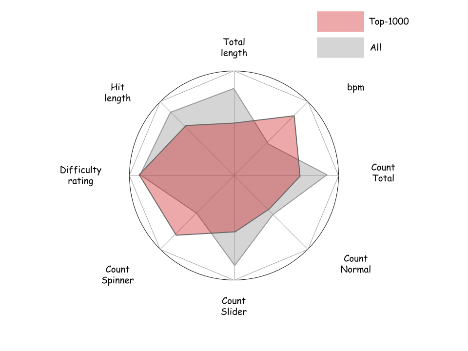

# Milestone 2 (7th May, 5pm)

**10% of the final grade**

## Visualisations  

### Beatmap visualisation
In order to be able to improve the beatmap difficulty evaluation system, the different beatmap features must be compared. The figure below displays the comparison between the 1000 most popular and all beatmaps.  

Comments:
* can visualise top-1000 among top players to find out how they get "free points"
* could be replaced by the barplot  

  

### Scores visualisation  

### Player skill improvement
To build a new score evaluation system it is important to understand which skills the are more likely to be improved by the players. The skills which remain unchanged over time/number of games played should be considered as a bad metric for evaluation.  

Comments:  
* not sure this viz is feasible with the data available
* the skill features should be probably normalized

## Tools
* D3.js  
* Preactjs

## Possible improvements  

Interactive plots:
* the user can move the vertices of the web chart and see the values   
* the user can move the vertical bar in the scores plot to see the probability  
